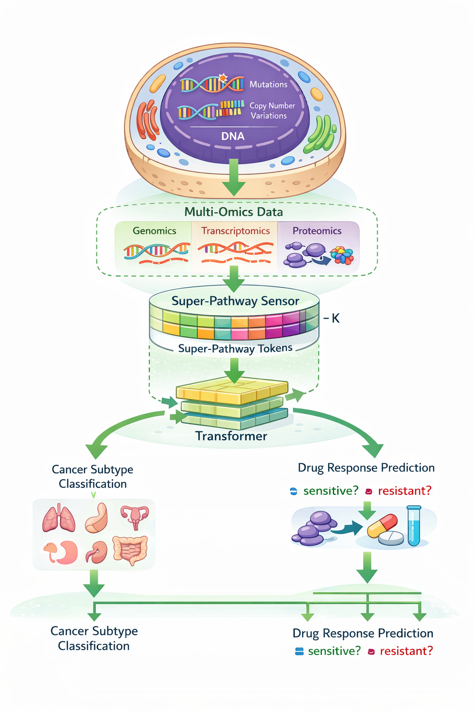

# Drug-Response-Prediction-Transformer
Super-Pathway Transformer for cancer drug response prediction using multi-omics data. The framework constructs hierarchical super-pathways from pathway networks and uses transformer attention with LRP-based interpretability to identify biologically relevant mechanisms in precision oncology.

<h2>Methodology Framework</h2>

